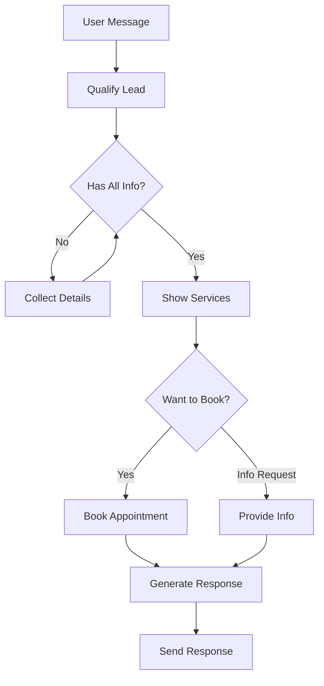

# LangGraph Implementation for Pet Grooming Discord Bot

This document describes the LangGraph implementation for the pet grooming Discord bot, which provides an intelligent conversational workflow for managing customer leads, pet information, and appointment booking.

## Overview

The LangGraph implementation transforms the simple Discord bot into an intelligent agent that can:

1. **Qualify leads** - Collect customer and pet information
2. **Show services** - Display available grooming services with pricing
3. **Book appointments** - Integrate with Google Calendar for scheduling
4. **Provide information** - Answer questions about business hours, location, etc.
5. **Follow up** - Handle stalled conversations and re-engage customers

## Architecture

### Core Components

1. **workflow_state.py** - Enhanced state management for conversation tracking
2. **workflow_nodes.py** - Individual workflow nodes for each business process
3. **workflow_graph.py** - LangGraph workflow definition with conditional routing
4. **service_integrator.py** - Integration layer for Google Sheets and Calendar
5. **test_workflow.py** - Test script for validating the workflow

### Workflow Flow



## Key Features

### 1. Intelligent State Management

The `ConversationState` class tracks:
- Customer information (name, phone, city)
- Pet details (name, breed, weight, age, coat condition)
- Workflow status and conversation history
- Service selection and appointment details

### 2. Conditional Routing

The workflow uses intelligent routing based on:
- Current conversation state
- User message content
- Missing information requirements
- Booking intent detection

### 3. Service Integration

Seamless integration with:
- **Google Sheets** for data persistence
- **Google Calendar** for appointment scheduling
- **LLM** for natural language understanding

### 4. Multi-Step Processes

The workflow handles complex multi-step processes:
- Lead qualification with missing field detection
- Service presentation with pricing
- Appointment booking with availability checking
- Follow-up for stalled conversations

## Workflow Nodes

### 1. Qualify Lead Node
- Creates initial lead record in Google Sheets
- Transitions to information collection
- Sets up conversation tracking

### 2. Collect Details Node
- Uses LLM to extract information from messages
- Identifies missing required fields
- Updates Google Sheets records when complete

### 3. Show Services Node
- Retrieves services from Google Sheets
- Calculates pricing based on pet characteristics
- Presents options to customer

### 4. Book Appointment Node
- Checks calendar availability
- Creates calendar events
- Updates appointment records

### 5. Provide Info Node
- Retrieves business information from Brands sheet
- Answers questions about hours, location, contact info

### 6. Follow Up Node
- Handles stalled conversations
- Sends reminder messages
- Re-engages inactive leads

## Usage

### Running the Bot

```bash
# Install dependencies
pip install -r requirements.txt

# Run the Discord bot
python discord_bot.py

# Test the workflow
python test_workflow.py
```

### Environment Variables

```bash
DISCORD_BOT_TOKEN=your_discord_bot_token
GOOGLE_SHEETS_CREDENTIALS_FILE=credentials.json
GOOGLE_CALENDAR_CREDENTIALS_FILE=calendar_credentials.json
GOOGLE_SPREADSHEET_ID=your_spreadsheet_id
```

### Example Conversation Flow

1. **User**: "Hi, I need grooming for my dog"
   - **Bot**: Welcomes and asks for details
   - **Status**: `qualifying`

2. **User**: "My name is John Smith, phone 555-1234. My dog Max is a Golden Retriever, 30kg, 3 years old"
   - **Bot**: Confirms information and shows services
   - **Status**: `qualified` → `showing_services`

3. **User**: "I want the full grooming package"
   - **Bot**: Shows available time slots
   - **Status**: `booking_appointment`

4. **User**: "Tuesday morning works"
   - **Bot**: Books appointment and confirms
   - **Status**: `booked`

## Data Flow

### Google Sheets Integration

1. **Leads Sheet**: Customer contact information and status
2. **Pets Sheet**: Pet details and grooming history
3. **Services Sheet**: Available services with pricing
4. **Appointments Sheet**: Scheduled appointments
5. **Brands Sheet**: Business information and settings

### State Persistence

- Conversation states are maintained in memory
- Critical data is persisted to Google Sheets
- Conversation history is tracked for context

## Testing

The `test_workflow.py` script provides comprehensive testing:

```python
# Test state management
test_state_management()

# Test full workflow
asyncio.run(test_workflow())
```

## Error Handling

The system includes robust error handling for:
- Google API failures
- LLM processing errors
- Invalid user input
- Network connectivity issues

## Extensibility

The modular design allows easy extension:

### Adding New Nodes
1. Create node function in `workflow_nodes.py`
2. Add routing logic in `workflow_graph.py`
3. Update state management if needed

### Adding New Services
1. Update Google Sheets with service information
2. Services are automatically available in workflow

### Custom Business Logic
- Modify `service_integrator.py` for custom pricing
- Update `workflow_nodes.py` for custom responses
- Extend `ConversationState` for additional fields

## Performance Considerations

- **Memory Usage**: States are held in memory for active conversations
- **API Calls**: Optimized to minimize Google API calls
- **Response Time**: LLM calls are asynchronous for better performance

## Security

- Credentials are managed through environment variables
- No sensitive data is logged
- Google API access is properly scoped

## Monitoring and Logging

Comprehensive logging is implemented:
- Workflow transitions
- API call results
- Error conditions
- Performance metrics

## Future Enhancements

Potential improvements:
1. **Database Integration** - Replace in-memory state with persistent storage
2. **Multi-language Support** - Internationalization capabilities
3. **Advanced Scheduling** - Recurring appointments and reminders
4. **Analytics Dashboard** - Conversation and booking analytics
5. **Payment Integration** - Online payment processing

## Troubleshooting

### Common Issues

1. **LLM Not Responding**
   - Check Google AI API credentials
   - Verify model availability

2. **Google Sheets Errors**
   - Verify service account permissions
   - Check spreadsheet ID configuration

3. **Calendar Booking Fails**
   - Confirm calendar credentials
   - Check calendar permissions

### Debug Mode

Enable detailed logging:
```python
import logging
logging.basicConfig(level=logging.DEBUG)
```

## Support

For issues or questions:
1. Check the logs for detailed error messages
2. Verify all environment variables are set
3. Test individual components using the test script
4. Review the Google API setup documentation
